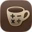

# My CoffeeCalc
## Brew better coffee

Brewing coffee is a science. The key to a delicious cup every day is a little math. This calculator does the math for you so you can effortlessly make amazing coffee. Let My CoffeeCalc handle the numbers. You enjoy the brew.

### CALCULATOR
The heart of My CoffeeCalc is a coffee brewing ratio calculator that gives you the right amounts of ground coffee and brew water needed to craft a perfectly balanced cup. Did you ever brew an incredible cup of coffee one day, then find yourself increasingly frustrated by your inability to reproduce those results? If consistency is your problem, brew ratios are the solution. Understanding your ratios transforms coffee from guesswork into reliable results. You'll brew consistently great coffee while gaining the control to adjust and perfect your ideal cup.

### PREFERENCES
Customize your experience by setting your preferred brew ratio as the default to make your daily brewing routine even more seamless.

### LEARN
My CoffeeCalc also includes a Learn section with a variety of articles designed to help you understand coffee brewing in greater detail. Explore topics like brew temperature, grind size, and essential brewing tools.

### RECIPES
Browse our curated selection of popular, reliable coffee brewing recipes from coffee experts for three of the most popular coffee brewing methods: pourover, french press, and AeroPress.

### APPLE WATCH
My CoffeeCalc also includes a streamlined watchOS app that provides a concentrated calculator function right on your wrist for quick brewing decisions.
